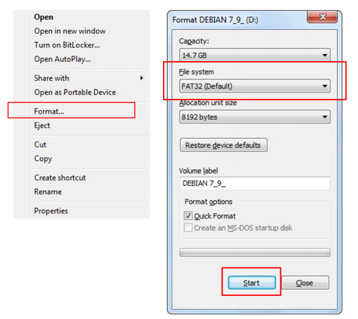
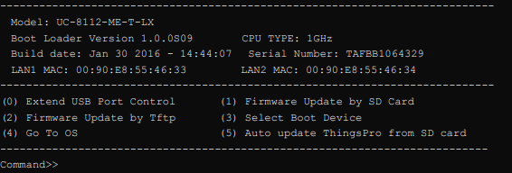
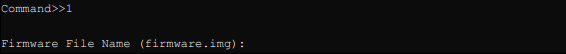
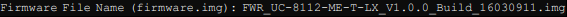
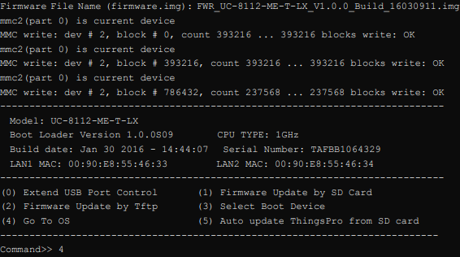
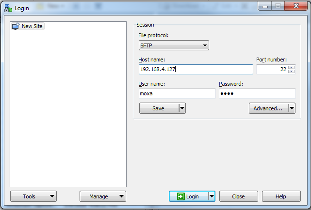
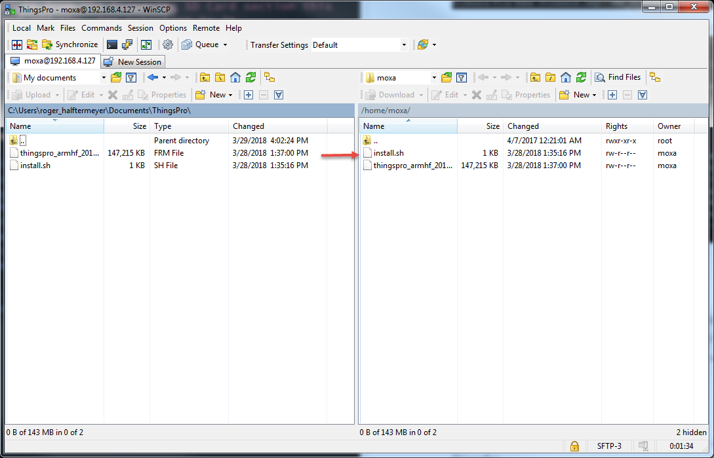
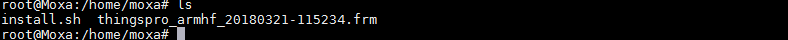
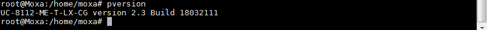

# ThingsPro Installation (for UC-8100-ME Series)

In this guide, we will be upgrading the UC-8100-ME Series to the newest firmware and installing ThingsPro onto the UC-8100-ME Series.

## Prerequisites

* MOXA console cable
* PuTTY or other Terminal Emulator Software 
* WinSCP
* SD Card 
* [Latest Firmware image](https://www.moxa.com/support/sarch_result.aspx?type=soft&prod_id=5155&type_id=4) (UC-8100-ME Firmware)
* Latest ThingsPro build
    * Links to the files needed:
        * [ThingsPro v2.3 for UC-8100 Series](https://www.dropbox.com/s/r8z299hhecx3at4/thingspro_armhf_20180330-001535.frm?dl=1)
        * [Installation Script](https://www.dropbox.com/s/8a6x5voq5qm1ahn/install.sh?dl=1)

## Preparing the SD Card for firmware upgrade (For Windows)

1. Insert an empty SD card to a Windows PC
2. Reformat the SD card to use the FAT32 file system:
    1. This can be done by right clicking on the SD card and clicking Format
    2. Change File system to FAT32 and click start
    

3. Once the Reformat is done, copy the newest firmware image onto the reformatted SD card 
    * Copy the image's name for later

## Updating the Firmware

1. Connect to the UC-8100-ME using the serial console 
2. Once the connection with the UC-8100-ME is made, power down the device
3. Insert the SD card with the Firmware image into the US-8100-ME
4. On the serial console, press and hold the `<DEL>`  key, while powering up the device, this will open up the bootloader configuration settings (If `<DEL>` is not working here, try to use [Tera Term](https://ttssh2.osdn.jp/index.html.en) instead of Putty.)
5. On the bootloader configuration settings, type "1" and press enter
    
    

6. The computer will then ask for an .img file that is on the SD card and press enter 
    * If you had previouly copied it from the Preparing SD Card section this would be the place to paste it and add the .img extention to it
    

7. Once the update is completed, press "4" to open the OS command line.

## Installing the ThingsPro Gateway

1. Connect to the UC-8100-ME using the serial console 
2. Open WinSCP and connect to the UC-8100-ME
    
3. Using WinSCP, copy the ThingsPro v2.3 and Install.sh to the UC-8100-ME 
    
4. Once the files have been copied to the UC-8100-ME, using the serial console type `ls` to confirm the files have been transfered
    
5. Run installation script
    * For the UC-8100-ME Series: `sudo bash install.sh  uc8100me-mxcloud-cg` 
    * For the UC-8100 Series: `sudo bash install.sh  uc8100-mxcloud-cg`
    > The entire process would take around 8-10 minutes including couple times of reboot.
7. Once the installation is done, run `pversion`
    
8. Confirm if the version shown is the one you installed, if so, you have successfully installed ThingsPro
