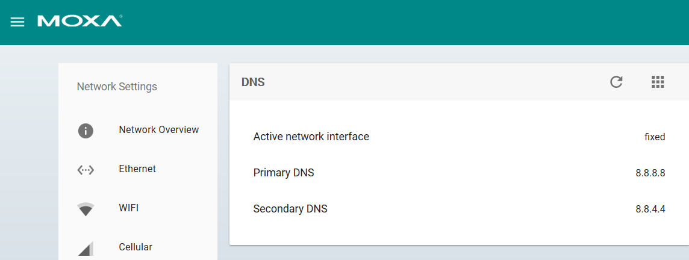
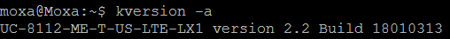
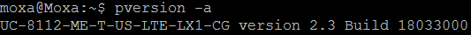
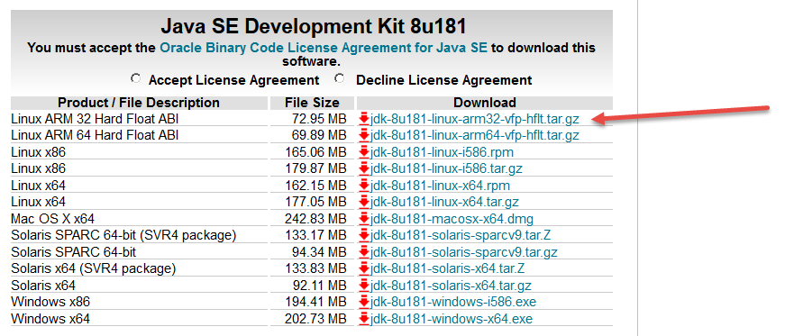
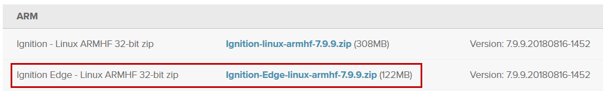

# Install Ignition Edge on Moxa UC-8100-ME Series

## Install Procedure Summary

1. Initial UC-8100 configuration
2. Ensure the latest UC-8100 firmware is installed
3. Download the latest Oracle Java SE ARM 32 Hard Float JVM
4. Copy the JVM to UC-8100 and untar it
5. Download the Ignition Edge ARM Hard Float image
6. Install the 'unzip' utility onto the UC-8100
7. Create /home/moxa/ignition, unzip Ignition Edge
8. Make all Ignition scripts executable
9. Edit the ignition.conf file and change Java settings
10. Disable any Ignition modules you don’t need
11. Start Ignition Edge
12. Download the MQTT Transmission Module
13. Install the MQTT Transmission Module
14. Set Ignition to run at boot
15. Reboot the unit

---

## Installation Procedure

### Step 1. Initial UC-8100 configuration

This procedure will require access to the Internet to install some additional Linux packages on the UC-8100. To do this, configure a WAN interface within ThingsPro, and a DNS server also needs to be available for the installation.

The following settings are recommended. Under the Gateway / Network / DNS menu, you will find the DNS settings.

Setup the Primary and Secondary DNS server as follows:

---

### Step 2. Ensure the latest UC-8100 firmware is installed

To check the version of Moxa Linux image, type `kversion -a` at the command line.
Example:

To check the version of ThingsPro, type `pversion -a` at the command line.
Example:

To install the latest version of kernel image and ThingsPro, instructions are here:
[ThingsPro Installation (for UC-8100-ME)](https://hackmd.io/s/r1NTxYF5G#)

### **Important: Debian packages update**

Perform the steps in this update: 
[Upgrading Debian packages on UC Series](https://hackmd.io/s/rJurxrbFQ#)

> This is a generic note describing how to perform Debian package upgrades.
> 
> The UC-8100 needs access to the internet for this process.

First perform the steps in “General(system-wide) Upgrade”.

Then perform the steps to upgrade these specific Debian packages:

* uc8100me-syskernel
* uc8100me-sysconfig
* uc8100me-system

---

### Step 3. Download the latest Oracle Java JVM

Download the latest Oracle Java SE ARM 32 Hard Float JVM from Oracle's website.

Using this link:
http://www.oracle.com/technetwork/java/javase/downloads/jdk8-downloads-2133151.html

Example:

---

### Step 4. Copy the JVM to UC-8100 and untar it

Transfer the JVM to UC-8100 and untar it. Just leave the file in /home/moxa directory on the UC-8100.

> Copy the jdk image file to the UC-8100 using an SCP or SFTP utility.
> The default Username and Password is “moxa” and “moxa”.

Connect to the UC-8100 via SSH, using PuTTY or similar utility, and run the following commands in the /home/moxa directory:

> Note: The filename will change as the version is updated. Use the latest version/filename.

Untar the JDK:
`moxa@Moxa:~$ sudo tar -xvzf jdk-8u181-linux-arm32-vfp-hflt.tar.gz`

Remove the tar.gz file:
`moxa@Moxa:~$ sudo rm jdk-8u181-linux-arm32-vfp-hflt.tar.gz`

---

### Step 5. Download the Ignition Edge ARM Hard Float image

Download the Ignition Edge Linux ARM Hard Float image from the Inductive Automation site:
https://inductiveautomation.com/downloads/ignition

Scroll down to ARM, and select the **Ignition Edge** file.

Example:

Copy the Ignition-Edge-xxx.zip file to the UC-8100, into the `/home/moxa` directory.

---

### Step 6. Install the 'unzip' utility onto the UC-8100

The 'unzip' utility isn’t installed by default on the UC-8100. 
Use apt-get update and then apt-get install unzip to perform the installation.

> Note: The UC-8100 needs access to the internet for this step.

Run these commands on the UC-8100 at the CLI via SSH connection:

`moxa@Moxa:/home/moxa$ sudo apt-get update`

`moxa@Moxa:/home/moxa$ sudo apt-get install unzip`

---

### Step 7. Create /home/moxa/ignition, unzip Ignition Edge

Create /home/moxa/ignition and unzip Ignition Edge into that directory:

    moxa@Moxa:/home/moxa$ sudo mkdir ignition

    moxa@Moxa:/home/moxa$ sudo unzip Ignition-Edge-linux-armhf-7.9.9.zip -d ignition

Remove the original zip file:

    sudo rm Ignition-Edge-linux-armhf-7.9.9.zip

---

### Step 8. Make all Ignition scripts executable

Make all scripts executable using chmod +x *.sh

    moxa@Moxa:/home/moxa$ cd ignition

    moxa@Moxa:/home/moxa/ignition$ sudo chmod +x *.sh

---

### Step 9. Edit the ignition.conf file and change Java settings

Edit the ignition.conf file and make the following changes:

1. Add Java to the path
2. Modify Initial and Maximum Java Heap Size

Change to the data directory:

    moxa@Moxa:/home/moxa/ignition$ cd data

Edit the file: `ignition/data/ignition.conf`

1. Modify `wrapper.java.command=java` 
to `wrapper.java.command=/home/moxa/jdk1.8.0_181/bin/java`

2. Modify `wrapper.java.initmemory` and `wrapper.java.maxmemory` 
to `wrapper.java.initmemory=256` and `wrapper.java.maxmemory=768`

---

### Step 10. Disable any Ignition modules you don’t need

Go to the user_lib/modules directory and disable any modules you don’t need.

For this use case that would include: alarming, EAM, tag historian, vision, etc.

The intent is for a minimal runtime for performance.

Change to the modules directory:
    `moxa@Moxa:/home/moxa/ignition$ cd user-lib/modules`

List the files:

    moxa@Moxa:/home/moxa/ignition/user-lib/modules$ ls
    Alarm Notification-module.modl
    Allen-Bradley Drivers-module.modl
    Enterprise Administration-module.modl
    Logix Driver-module.modl
    Modbus Driver v2-module.modl   
    MQTT-Transmission-signed.modl
    OPC-UA-module.modl               
    Siemens Drivers-module.modl
    Tag Historian-module.modl
    Vision-module.modl

Rename the unwanted files, for example:

    sudo mv Alarm\ Notification-module.modl Alarm\ Notification-module.modl.org
    sudo mv Enterprise\ Administration-module.modl Enterprise\ Administration-module.modl.org
    sudo mv Logix\ Driver-module.modl Logix\ Driver-module.modl.org
    sudo mv Siemens\ Drivers-module.modl Siemens\ Drivers-module.modl.org
    sudo mv Tag\ Historian-module.modl Tag\ Historian-module.modl.org
    sudo mv Vision-module.modl Vision-module.modl.org
    
---

### Step 11. Start Ignition Edge

Start Ignition Edge at the command line

    moxa@Moxa:/home/moxa/ignition$ sudo ./ignition.sh start

---

### Step 12. Download the MQTT Transmission Module

Download the MQTT Transmission Module from Inductive Automation's website to your PC.

---

### Step 13. Install the MQTT Transmission Module

* Open the Ignition Edge console on the UC-8100, 
* login,
* go to the Modules tab,
* and install MQTT Transmission

---

### Step 14. Set Ignition to run at boot

Set Ignition to run as a service:

    moxa@Moxa:/home/moxa$ ./ignition/ignition.sh install

    moxa@Moxa:/home/moxa$ systemctl enable Ignition-Gateway

    Synchronizing state for Ignition-Gateway.service with sysvinit using update-rc.d...
    Executing /usr/sbin/update-rc.d Ignition-Gateway defaults
    Executing /usr/sbin/update-rc.d Ignition-Gateway enable

---

### Step 15. Reboot the unit

    moxa@Moxa:/home/moxa$ reboot
