# ThingsPro/Ignition: Solar Montioring

## Overview
ThingsPro is an intergrated Modbus communication, computing, data acquisition, and wireless network solution. In this application, ThingsPro will be hosted on the UC-8100-ME, which will be utilized as the gateway. This will allow the users to interact with field equipments.

In this application, our gateway (UC-8100-ME) will be acquiring solar panel data from the MGate. The MGate acquires Modbus RTU data from the power meter and translates the data to Modbus TCP for ThingsPro to capture.


## Prerequistes
1. UC-8100-ME (Things Pro)
2. Ignition (SCADA software)

## Installation

It is assumed that ThingsPro is already installed on the UC-8100-ME. Instructions on how to install ThingsPro can be found [here](/get-started/UC-8100-ME-series).

## ThingsPro 
By default, ThingsPro is accessed through port 2 of the UC-8100-ME. It is important that your computer IPv4 address is in the same subnet as the port 2.

The **default address** for this port is ```192.168.4.127```. 

Log in credentials for ThingsPro:
> **Email:** admin@moxa.com
> **Password:** admin1234

### Templates and Tags

Under Menu, select **MODBUS & Logging**. 

With the template management on ThingsPro, you can create and manage Modbus tags. 

To add a template for a Modbus Device, click the add icon.

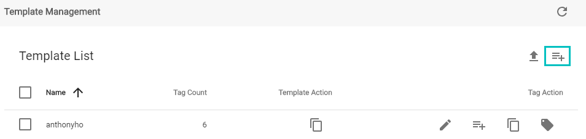

After creating the template, head over to the template click the add icon to add tags.

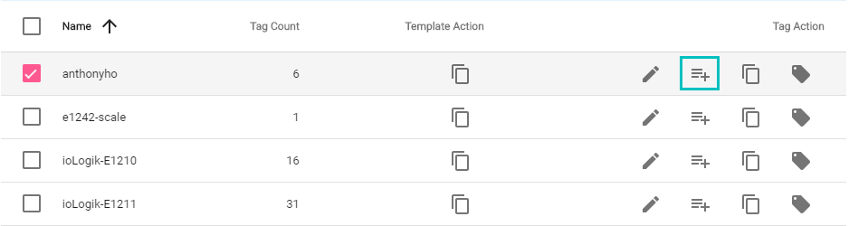

Here is an example tag that I created for my template (anthonyho) to monitor the Total Real Energy (kWh), a signed net sum of all energy imported and exported.

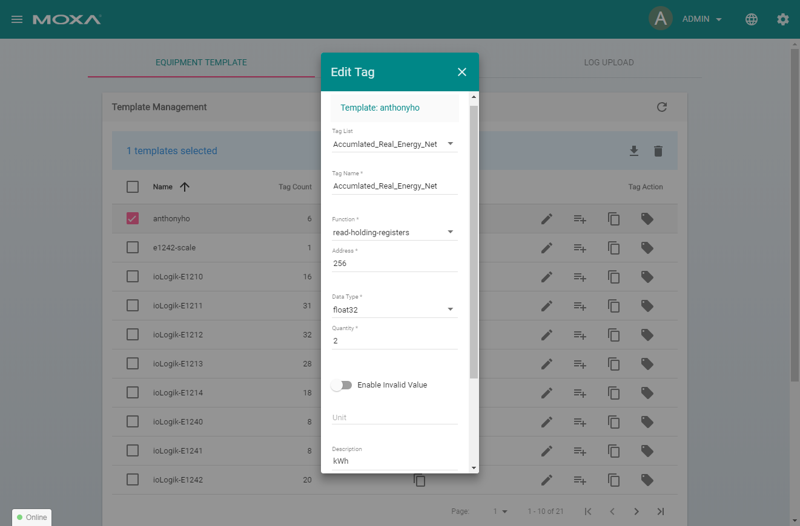

### Modbus Management and Test

Select Modbus Device to test your tags. Under Modbus Management, you will select the communication that is established for data acquisition. As I mention above, this application acquries data through Modbus TCP.

To add a TCP interfance, click the add icon. 

On the newly created TCP interface, click the pencil icon on the far right to test the template that contains your tags.

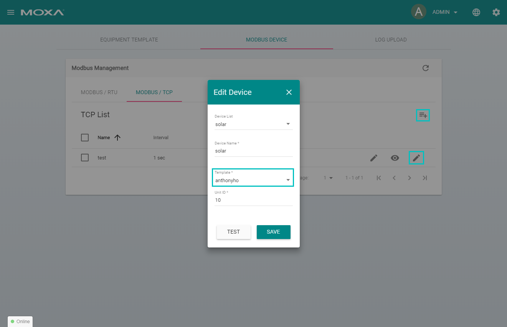

Here is an example output of a successful test.

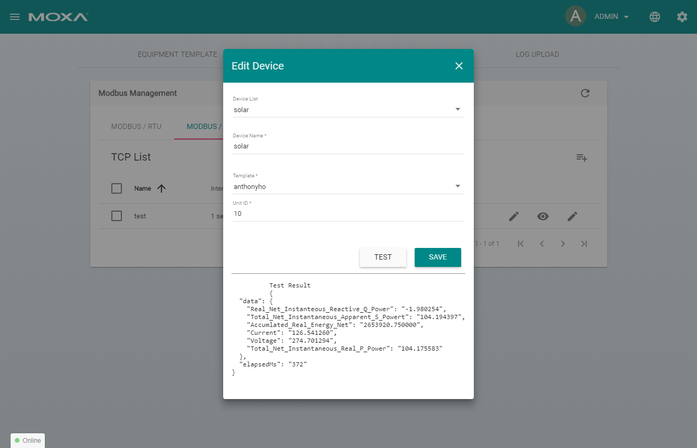

## Intergrating ThingsPro with Ignition (SCADA)

Navigate to Ignition Gateway by going to the address ```http://localhost:8088``` on any browser. 

MQTT protocol is used to extract data from ThingsPro.

On the configure page of the Ignition Gateway, scroll down the Platform and click *Install or Upgrade a Module*.

Two modules will be required for this application, **MQTT Distrubtor** and **MQTT Engine**. MQTT Distrubtor is required because the computer is the broker and it is reponsible for receiving all messages and sending the message to the subscribed client. In our case, our client is Ignition. The MQTT Engine will publish ThingsPro's acquired data to the broker.

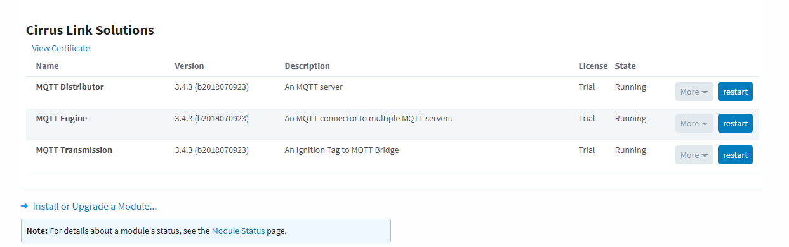
 

With both modules installed, navigate to MQTT Distributor settings to update the username and password. Then, head to MQTT Engines settings to update the server.

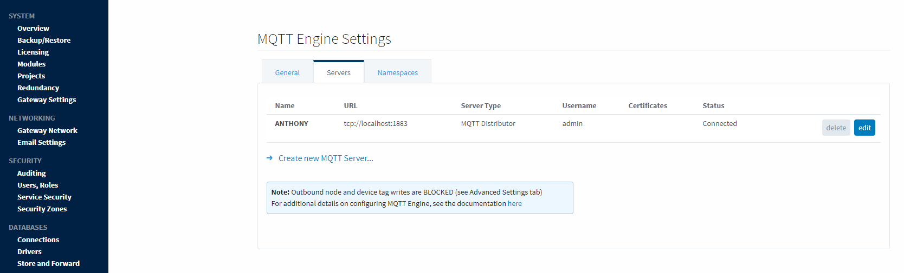

With MQTT settings configured, Navigate to ThingsPro's Menu and select Sparkplug under Applications. Add the broker, which is your computer. 

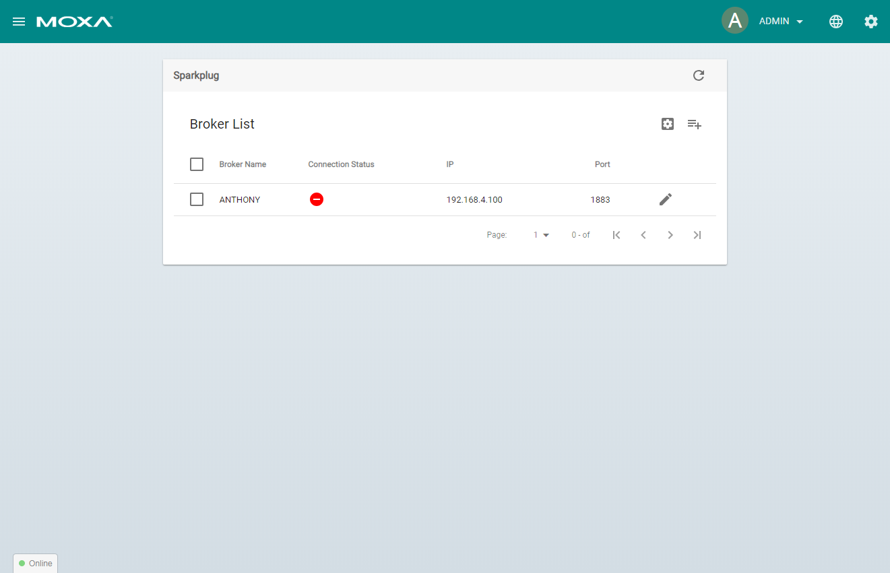

Click the add icon and create a name for the broker. As an example, I created a new broke under ```__brokerNAME__```. Edit the broker by selecting the pencil icon. 

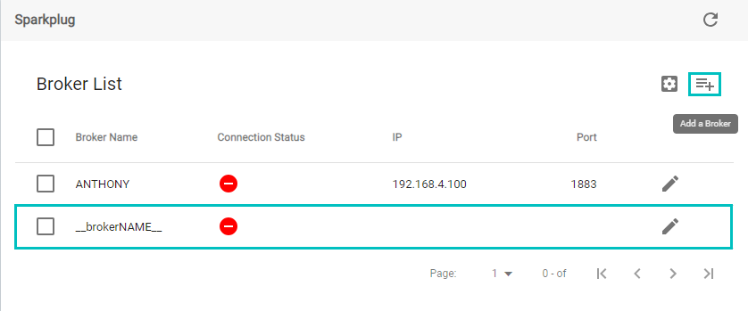

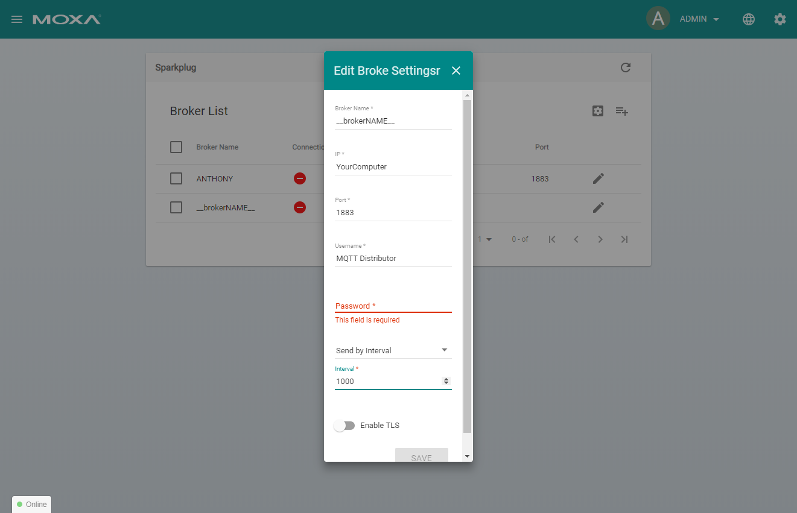

> **IP**: The IP address of the computer where the MQTT server is located.
> **Port**: 1883, a reserved port for MQTT services.
> **Username**: The same username that was created in MQTT Distributor.
> **Password**: The same password that was created in MQTT Distributor.
> **Interval**: Common poll rate is 1000ms. 

### Ignition


Start Ignition Designer and create a new project. Under Tag Browser, you will find all the tags that you created in ThingsPro as shown below. 

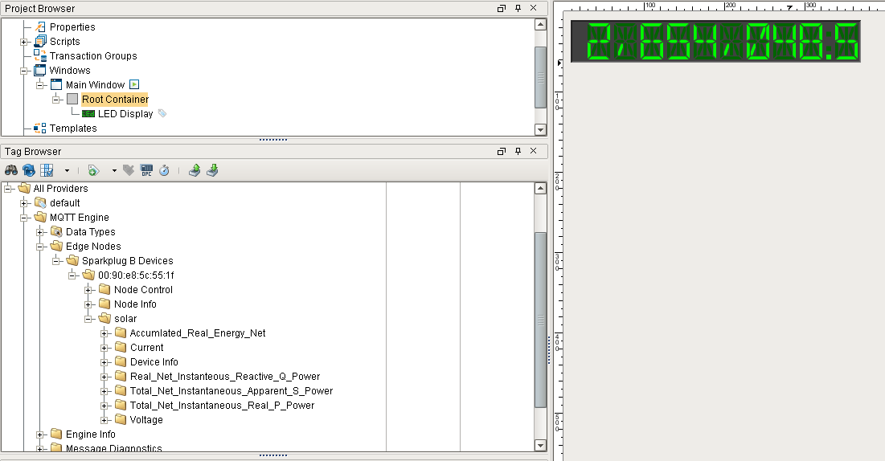